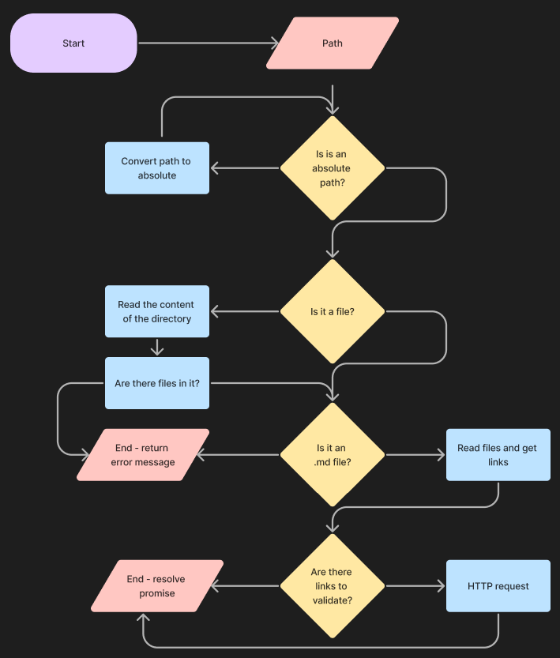
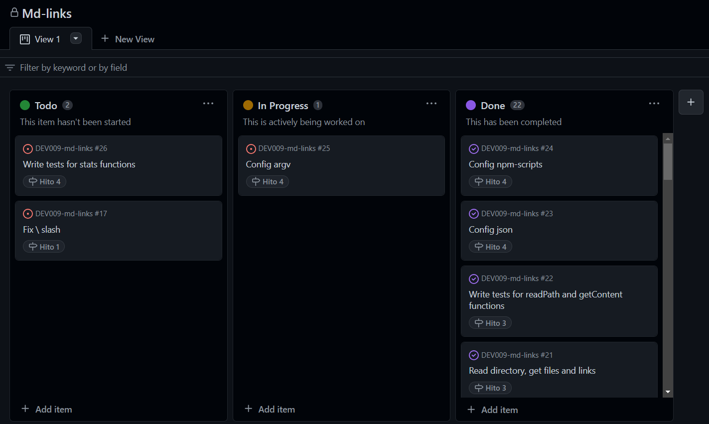

# mdlinks

<p align="center">

</p>

## Description

`mdlinks` is an npm package designed to parse Markdown files, extract links, and provide validation for those links. It can be used to automate link checking within your Markdown documents, ensuring that all links are valid and not broken.

## Features

* Parses Markdown files to find all links contained within them.
* Provides detailed information about each link, including the link URL, anchor text, and the file in which it was found.
* Validates each link to check if it's alive (not broken) or dead (broken).
* Simple and easy-to-use command-line interface (CLI).

## Flowchart

This flowchart illustrates the step-by-step process that occurs once a path is provided to mdlinks.



## Installation

To install mdlinks globally and use it from the command line, run the following npm command:

`npm install -g mdlinks`

To use it as a local dependency in your project, run:

`npm install mdlinks`

You can also install from GitHub:

`npm install github:AndressaSRodrigues/DEV009-md-links`

## Usage

### Command Line Interface (CLI)

To run mdlinks from the command line, use the following syntax:

``
mdlinks path/to/markdown/files [options]
``

Replace `path/to/markdown/files` with the relative or absolute path to the directory or Markdown file you want to analyze.
**Important!** A path must be provided.

#### Options

**--validate**: if provided, mdlinks will validate each link found in the Markdown files and display their status (OK or Fail).

**--stats**: if provided, mdlinks will display statistics about the links found, including the total number of links and the number of unique and broken links.

**--validate --stats**: if provided, mdlinks will display statistics about the links validated, including the the total number of links, unique links, the number of valid links (OK) and the number of broken links (Fail).

#### Examples

* To find all links:

Input:

```bash
mdlinks testing_links.md
```

Output:

```bash
mdlinks testing_links.md
The following links were found:[
  {
    href: 'https://nodejs.org/',
    text: 'Node.js',
    file: 'C:\\Users\\example\\testing_files\\testing-links.md'
  }
]
```

* To find and validate all links:

Input:

```bash
mdlinks testing_files --validate
```

Output:

```bash
mdlinks testing_files
The following links were found and validated:[
  {
    href: 'https://nodejs.org/',
    text: 'Node.js',
    file: 'C:\\Users\\example\\testing_files\\testing-links.md',
    status: 200,
    statusText: 'OK'
  }
]
```

* To get statistics:

Input:

```bash
mdlinks testing_files --stats
```

Output:

```bash
Number of links found: { Total: 8, Unique: 5 }
```

* To get validation statistics:

Input:

```bash

mdlinks testing_files --stats --validate
```

Output:

```bash
Validation statistics: { Total: 8, Unique: 5, OK: 5, Broken: 3 }
```

## Project Planning and Organization

This project follows an agile development methodology and leverages GitHub's project boards for efficient organization and progress tracking.

### Milestones

The project has been divided into four different milestones, each representing a significant phase of development. Each milestone comprises specific tasks that contribute to completing different parts of the project. For effectiviness, we used GitHub issues for each individual task in a milestone.

### GitHub Project Board

During the project's development, we utilized GitHub's project board to manage tasks and track progress. The board is divided into several columns representing different stages of development:

**To Do**: This column contains all the tasks that are planned but not yet started.

**In Progress**: Tasks that contributors are actively working on are moved to this column.

**Done**: Tasks that have been successfully reviewed and completed are moved to this column.

Here's an example of our board:



## Developers

This project was developed by Andressa Rodrigues.

This project was developed as part of the curriculum for the Laboratoria bootcamp. Special thanks to the instructors and mentors at Laboratoria for their guidance and support during the development process, and to my colleagues who helped me throughout this challenge.

Thank you for using **mdlinks**. We hope this package simplifies the process of finding and validating links in your Markdown files. Happy coding!
